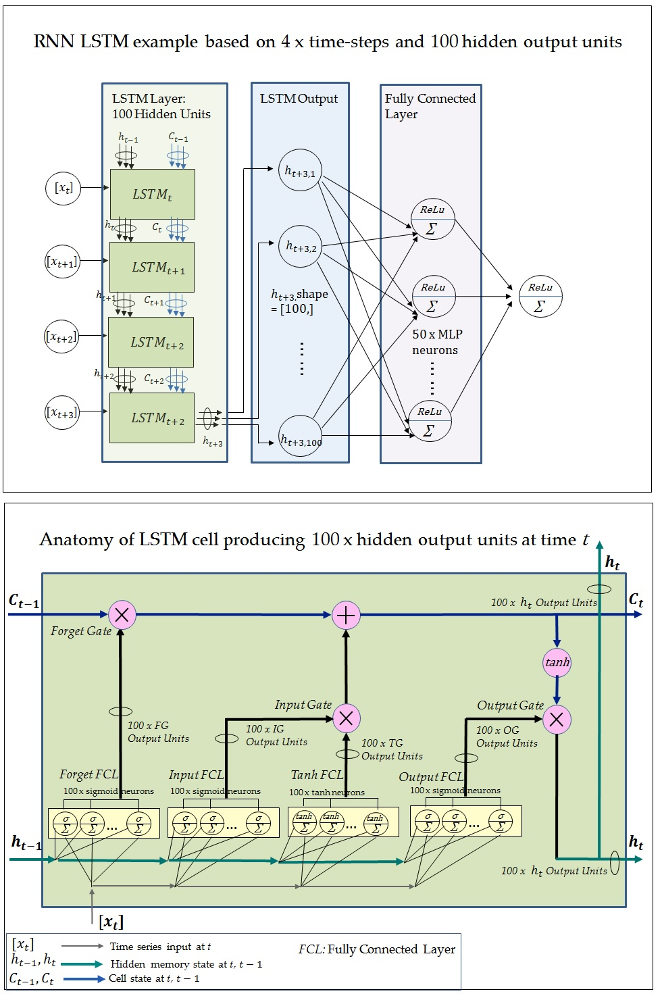

# Deep_Learning_JupyterLab
A JupyterLab pod is deployed in Kubnetes to use DL models trained and shipped from Google Colab.

In this example, an RNN model is built with LSTM in Colab to predict the number of tropical cylones that results in the hoisting of typhoon signal 8 or above in HK in a calendar year.

  The architecture of such a model is illustated in the following diagrams. It consists of a LSTM layer of 100 output units, together with a fully connected layer of 50 neurons. A scalar output for the current yearly number is predicted from an observation of 4 yearly timesteps.

  1.  Create a host volume on K8s nodes, to be owned by uid 1000 and gid 100.
  <pre>
  groupadd -g 100 users
  useradd -g 100 -u 1000 jovyan
  mkdir -p /var/tmp/jovyan/data
  chown -R 1000:100 /var/tmp/jovyan/data
  </pre>
  
  2.  Apply the provided yaml manifest to deploy a K8s pod and service for JupyterLab.
  <pre>
  kubectl apply -f https://raw.githubusercontent.com/snpsuen/Deep_Learning_JupyterLab/main/script/jupyter-notebook.yaml
  </pre>
  After that, run kubectl logs against the pod to obtain the URL and token for access to JypterLab, e.g.
  <pre>
    copy and paste one of these URLs:
        http://jupyter-notebook-deployment-5c4f85c78f-q89dj:8888/lab?token=1e07dd2c26a17fe32d835c8469912cba485f32e5e2ee7bda
    or  http://127.0.0.1:8888/lab?token=1e07dd2c26a17fe32d835c8469912cba485f32e5e2ee7bda
  </pre>
 
  3.  The lab will run in the working directory /home/jovyan that contains the following folders, which are local to the container, exccept /home/jovyan/data that is mounted on /var/tmp/jovyan/data on a K8s node.
  <pre>
  /home/jovyan
  ├── data
  ├── input
  ├── model
  ├── notebook
  ├── work  
  </pre>

4. Notebook template [Template_of_RNN_TC8_Annually_Local.ipynb](https://github.com/snpsuen/Deep_Learning_JupyterLab/blob/main/script/Template_of_RNN_TC8_Annually_Local.ipynb) is meant to be uploaded to Google Colab, where it will be executed to build and train an RNN LSTM sample model. The model will subsequenty swing from Colab via this repo to the JuypyterLab container.  
To this end, Colab is required to connect to the local runtime of JupyterLab, e.g. http://localhost:8888/lab?token=1e07dd2c26a17fe32d835c8469912cba485f32e5e2ee7bda
